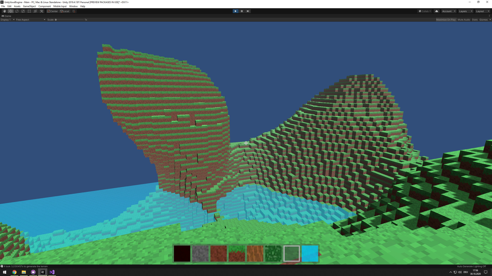
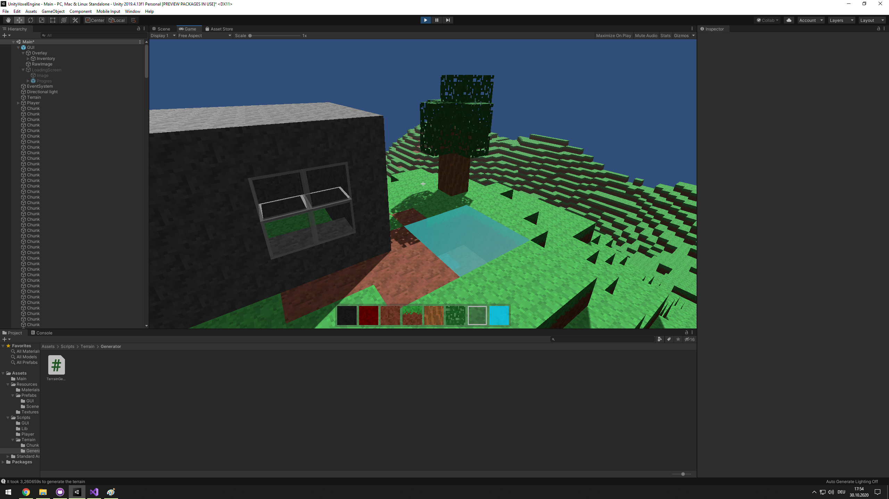

  </img>
  </img>
  <h1>Unity Voxel Engine</h1>
  
  An interactive Voxel Engine
  
  
<a href="https://lischilpp.github.io/unity-voxel-engine-demo/" target="_blank">Live Demo</a>

## 🗺️ Navigation 
- [<code>🖼️ Screenshots</code>](#-screenshots)
- [<code>📋 Features</code>](#-features)
- [<code>📦 Getting started</code>](#-getting-started)
- [<code>📝 License</code>](#-license)

## 🖼️ Screenshots

  
  

## 📋 Features
- Fixed size spherical chunk loading
- Support for transparent materials (like glass) and connected blocks (like water)
- Different block types
- Terrain generator from noise
- Place and destroy blocks (right and left click)
- Fast block destroying (press and hold **f** key)

## 📦 Getting Started
1. Clone this repository and open it in Unity3D
2. Open the scene "Main" from Assets
5. Press play and have fun!

## 📝 License
This project is licensed under the MIT License - see the [LICENSE](LICENSE) file for details
