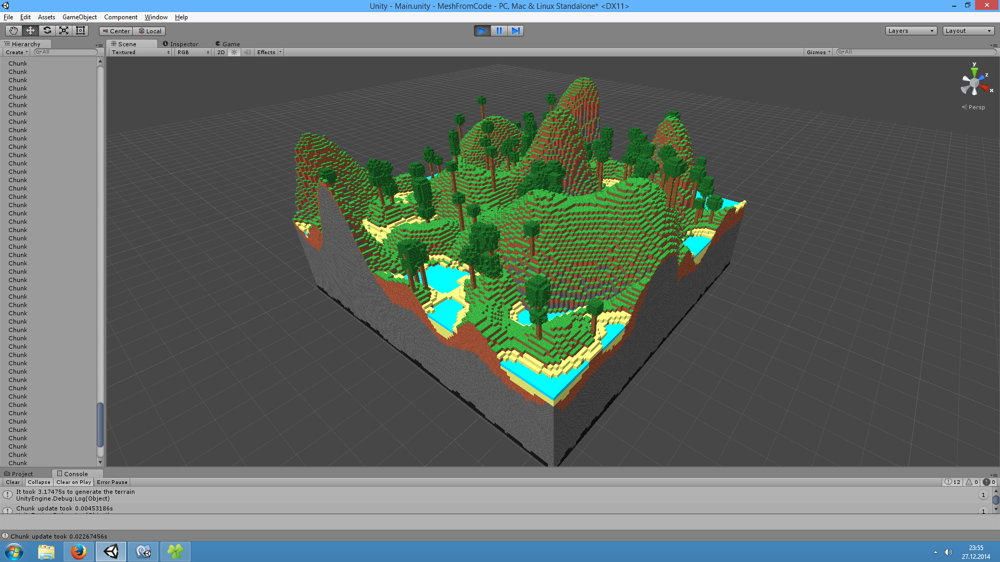
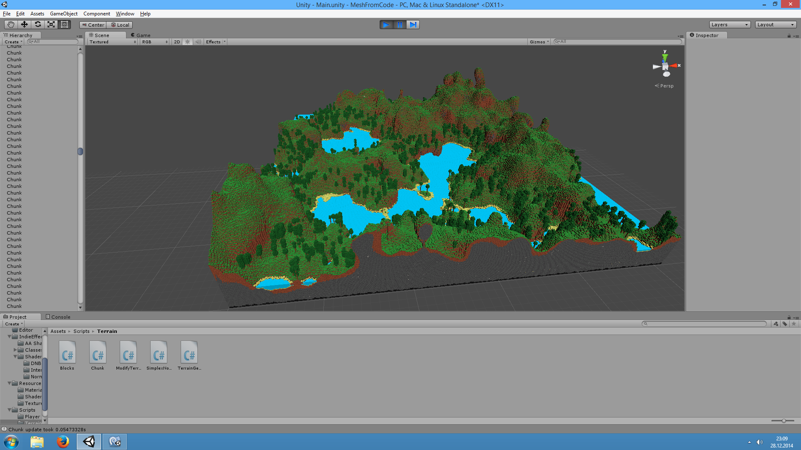

# UnityVoxelEngine

## Features
- Fixed size spherical chunk loading
- Support for transparent materials (like glass) and connected materials (like water)
- Different block types
- Terrain generator from noise
- Place and destroy blocks (right and left click)
- Fast block destroying (press and hold **f** key)

## Screenshots

## Getting Started
1. Clone this repository and open it in Unity3D
2. Import **FirstPersonCharacter**,  **CrossPlattformInput** and **Utility** from Standard Assets (for Unity 2018.4)  
(can be downloaded from Asset Store)
3. Open Scene Main (by double-clicking)
4. Press Play to start (this will fail, since the standard assets are out of date!)
5. Double click the Error ** 'GUIText' is obsolete: 'GUIText has been removed. Use UI.Text instead.'**
6. Fix it by adding import **using UnityEngine.UI;** and replacing **public GUIText camSwitchButton;** with **public Text camSwitchButton;**
5. Press play again and have fun!
