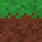

  
  <h1>Unity Voxel Engine</h1>
  

    </img>
    </img>
  

  
An interactive Voxel Engine

  
<a href="https://lischilpp.github.io/unity-voxel-engine-demo/">Live Demo</a>

  
Table of Contents

  <ul>
    <li><a href="#screenshots">Screenshots</a></li>
    <li><a href="#features">Features</a></li>
    <li><a href="#getting-started">Getting started</a></li>
    <li><a href="#license">License</a></li>
  </ul>

## Screenshots
<table>
  <tr>
    <td></td>
    <td></td>
  </tr>
</table>

## Features
- Fixed size spherical chunk loading
- Support for transparent materials (like glass) and connected blocks (like water)
- Different block types
- Terrain generator from noise
- Place and destroy blocks (right and left click)
- Fast block destroying (press and hold **f** key)

## Getting Started
1. Clone this repository and open it in Unity3D
2. Open the scene "Main" from Assets
5. Press play and have fun!

## License
This project is distributed under the MIT License - see the [LICENSE](LICENSE) file for details
